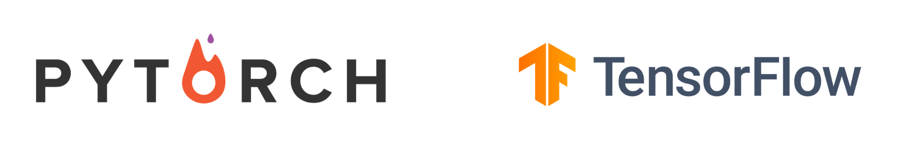

### Hi there, I'm Ali  👋 

## I'm a student, Developer, and translater!!

- 🔭 I just started in artifitial inteligence
- 🌱 I’m currently learning everything 🤣
- 👯 I’m looking to collaborate with other content creators
- ⚡ Fun fact: I lave watching and playing futball
- 🥅 2021 Goals: Contribute more to Open Source projects
- 🥅 2021 Main life Goal: Creat something new that can be usefull

### Connect with me:

[][linkedin]
[][instagram]

 

### Languages and Tools:

[]
[]
[]
[]
[]

 
 

---

[instagram]: https://www.instagram.com/ali_hk96/
[linkedin]: https://www.linkedin.com/in/ali-hamza-9915865b/
